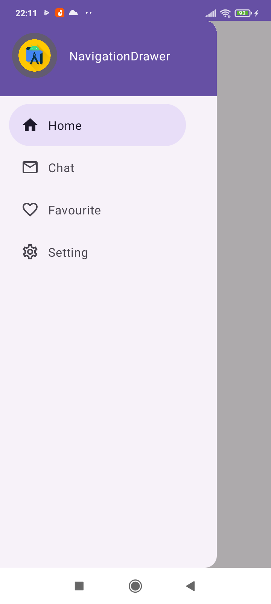

# Navigation Drawer with Jetpack Compose and Material 3

This Android project showcases the implementation of a Navigation Drawer using Jetpack Compose, Material 3, and the Navigation Component. The Navigation Drawer provides an intuitive way for users to access various sections of the app, enhancing the overall navigation experience.

## Features

- **Jetpack Compose:** Utilizes the modern Android UI toolkit for building native interfaces.

- **Material 3 Design:** Adheres to the Material 3 design principles, offering a visually appealing and consistent user interface.

- **Navigation Component:** Integrates the Navigation Component to manage navigation within the app, ensuring a seamless flow between different screens.

- **NavHost Implementation:** Utilizes the `NavHost` to define the navigation graph and handle navigation actions, providing a structured and efficient way to manage the app's navigation.

## Getting Started

To explore the project, simply clone the repository and open it in Android Studio. Make sure to have the required dependencies, including Jetpack Compose and Navigation Component, added to your project.

## Screenshots

  
  

## Customize and Extend

Feel free to customize the code according to your app's requirements. Add more destinations to the Navigation Component, modify the Drawer menu items, and enhance the styling with Material 3 components.
